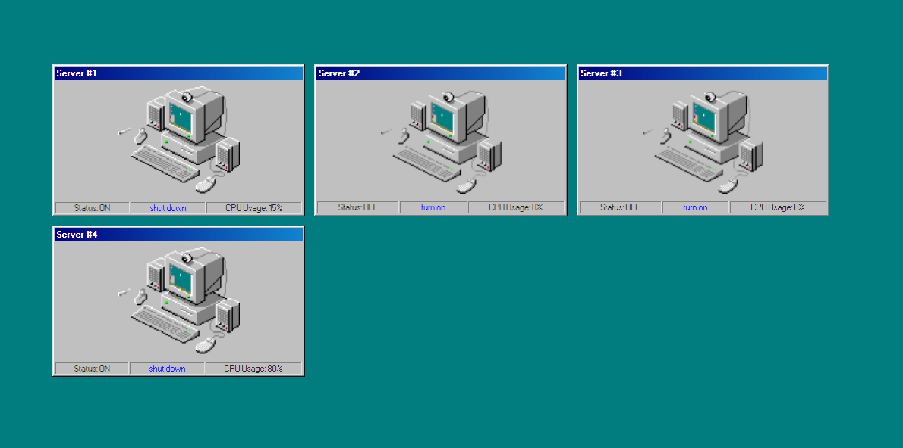

# Innovid challenge: Load balancer
Tenemos que crear una aplicación que muestre la carga de nuestros servidores 1, 2, 3 y 4, lamentablemente nuestro backend no tiene implementado un método para obtenerlos todos al mismo tiempo así que hay que traerlos de a uno, en paralelo.

## API
* GET https://localhost:8000/status/:id -> Obtiene la carga de un servidor

> El código de la API no debe ser modificado.

## Frontend
* Debe mostrar la carga de los cuatro servidores.
* La carga se debe actualizar cada 5 segundos.
* Puedo prender y apagar servidores (dejo de traerme su carga).

> TODO el código de la aplicación frontend puede ser modificado.
> El proyecto incluye SASS y [98.css](https://jdan.github.io/98.css) para usar a disposición, los assets se encuentran en la carpeta `assets` dentro del proyecto del cliente.



## Corriendo el proyecto
```bash
# Instalar dependencias del proyecto
npm install

# Instalar dependencias de los paquetes
npm run bootstrap

# Correr el servidor de desarrollo
npm start
```

## Modalidad de entrega
* Repositorio público subido a GitHub, Gitlab, Bitbucket.
